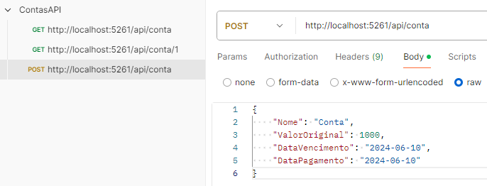

# Contas API


# 

> Este projeto é uma API RESTful desenvolvida utilizando o framework .NET Core 8 e a linguagem de programação C#. A API permite aos usuários realizar operações de inclusão e listagem de contas a pagar, seguindo as regras de negócio especificadas.

## 🔧 Tecnologias Utilizadas

No projeto, as principais tecnologias adotadas foram o .NET Core 8 e a linguagem de programação C#. Os dados são armazenados em um banco de dados relacional MySQL e manipuladas usando Entity Framework Core.


## 💻 Pré-requisitos

Antes de começar, verifique se você atende aos seguintes requisitos:

- Você tem uma máquina com o .NET Core SDK instalado
- Você tem um editor de código compatível com o .NET Core, como o Visual Studio Code
- Você tem um banco de dados MySQL configurado e acessível pela aplicação

## 🚀 Instalando a API

Para instalar e configurar a API, siga estas etapas:

- Clone este repositório para o seu ambiente local
- Abra o projeto no seu editor de código preferido
- Configure o banco de dados MySQL no arquivo appsettings.json
- Execute o seguinte comando no terminal do projeto para aplicar as migrações e atualizar o banco de dados:
```
dotnet ef database update --context DataBaseContext
```

Após configurar o projeto, você pode executá-lo para iniciar a API, utilizando o seguinte comando:
```
dotnet run
```

## 🌐 Endpoints da API

### Incluir Conta
- Endpoint: POST /api/Conta
- Descrição: Adiciona uma nova conta a pagar.
- Exemplo de Corpo da Requisição:
```
{
  "nome": "Conta de Luz",
  "valorOriginal": 150.75,
  "dataVencimento": "2024-06-15",
  "dataPagamento": "2024-06-18"
}
```

### Listar Contas
- Endpoint: GET /api/Conta
- Descrição: Lista todas as contas cadastradas.
- Exemplo de Resposta:
```
[
  {
    "id": 1,
    "nome": "Conta de Luz",
    "valorOriginal": 150.75,
    "valorCorrigido": 153.76,
    "diasAtraso": 3,
    "dataPagamento": "2024-06-18"
  }
]
```

## 📄 Documentação

Para mais detalhes sobre o projeto, consulte o arquivo [DOCUMENTACAO.md](DOCUMENTACAO.md), que contém a documentação técnica e informações sobre a concepção do projeto.


## 🤝 Colaboradores

<table>
  <tr>
    <td align="center">
      <a href="https://github.com/pbgollo" title="Perfil do Pedro Gollo no GitHub">
        <br>
        <sub>
          <b>Pedro Gollo</b>
        </sub>
      </a>
    </td>
  </tr>
</table>
